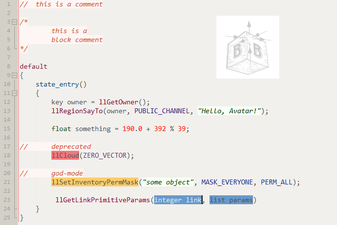
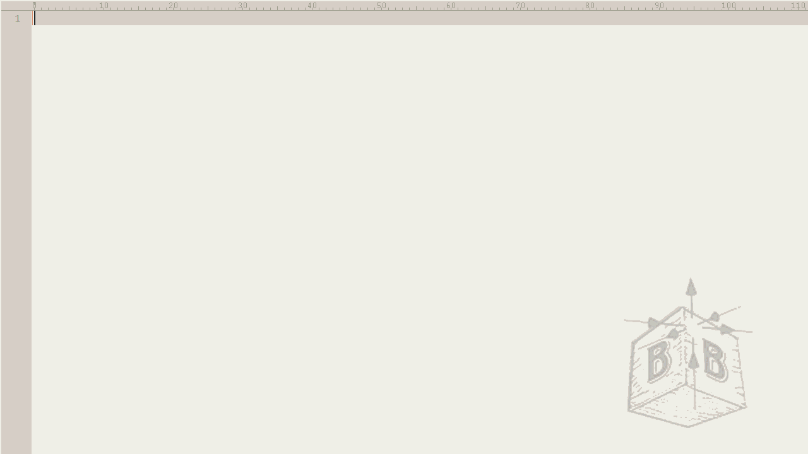

## Contributing to UltraEdit

The wordfiles can be found at:

* <https://github.com/IDMComputerSolutions/wordfiles>

## Usage:

* Add the files before opening the editor:
    * Copy and paste [lsl.uew](UltraEdit/wordfiles/lsl.uew) to `...\UltraEdit\wordfiles\lsl.uew`. Make sure the first few characters [in the first line of lsl.uew](UltraEdit/wordfiles/lsl.uew#L1) are changed to the lowest unused number in your wordfiles (every wordfile has something like `L8` or `L13`). In my case it is `L16`.
    * Copy and paste [lsl-tpl.xml](UltraEdit/language/lsl-tpl.xml) to `...\UltraEdit\language\lsl-tpl.xml`.
    * In UltraEdit go to `View > Themes > Manage Themes`, click the Add button `(+)` and select `Add existing theme...` then browse to and select the temporary copy of [lsl.ue-theme](UltraEdit/themes/lsl.ue-theme) to import.
* Open the editor and:
    * go to `Advanced > Configuration > Editor > Auto-complete` and tick the option to `Show auto-complete dialog automatically` after 2 characters.
    * change the settings under `Advanced > Configuration > Editor > WordWrap/Tabs` to convert tabs to `4 spaces` when working with LSL.
* When you want to have syntax highlighting and autocompletion:
    * Open a file with `*.lsl` extension or save your file with `*.lsl` extension.
    * Go to `View > View as (Highlighting File Type) > LSL`.

## [LSL](http://wiki.secondlife.com/wiki/LSL_Portal) Syntax:

## [LSL](http://wiki.secondlife.com/wiki/LSL_Portal) Autocompletion:

